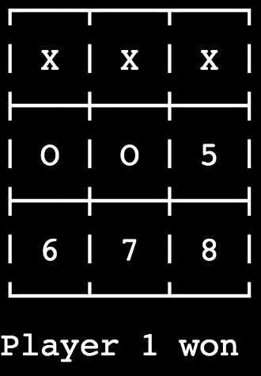

# tic tac toe made in Perl

## Holberton Cali  // Cohort 10

### Team members
* Oscar Gomez Toro
  https://github.com/oscargomez87
* Jesus Acevedo Cano 
  https://github.com/Jesus-Acevedo-Cano
* Mauricio Drada Dávila
  https://github.com/Mauricio-KND
* Jhonatan Legarda Cruz
  https://github.com/steven-cruz

### About the Perl language
Perl is a highly capable, feature-rich programming language that supports object-oriented, procedural and functional programming,  includes powerful tools for processing text that make it ideal for working with HTML, XML, and all other mark-up and natural languages, due to this and a rapid development cycle is an ideal web programming language. Originally developed for text manipulation and, nowadays is used for a wide range of tasks including system administration, web development, network programming, GUI development, and more.

### code info here

Tic Tac Toe.

### In the following steps we explain how the game works and how it is built.

## Building.

in the subroutine Begin to define the fields to play, accept the turns to define any given tie, and define a flag to know if any of the players was the winner.
A single variable is used to define the destination of the winning player and we add that variable to what the Start subroutine returns.
The BEGIN subroutine is the one that we use in Perl to initialize, and from this, we call the board function, where it shows us the playing field in the command window where we can play; This sends a reference to the array with the possible playing fields.
the next step is to define the player's turn, for this we use a variable that tells us whose turn it is at the moment and then we start a loop where we will call the subroutine turn and send which is the player and the arrangement with the marked fields, in this way we define the subroutine in turn where it can receive the information required by the player by formatting the entry and eliminating the entry or as we know it better the line break. Knowing the meaning of the two players the turn has at that moment, the value of the field is replaced in our arrangement with a respective symbol, it may well be X or O whose turn it is.
In the flag variable, we assign what has made us the compare subroutine where we will send our marker arrangement by the players and verify the possible combinations to win the game, in this way it is checked if the symbols are found in the correct positions to define a winner, in this same subroutine a new subroutine is called, which is called verify that it verifies if the string created in the subroutine compares has the same three elements, if this is correct, it returns the number with which the player is represented; This information is repeatedly a start where it is verified if the value of the flag was modified if this change returns the value indicating which player has been the winner.

Game

The first player, to be selected "X", has 3 possible positions to score during the first turn. On the surface, there might be 9 possible positions, corresponding to the 9 squares on the grid. However, by turning the board, we will find that, on the first turn, each corner mark is strategically equivalent to any other corner mark. The same is true for each edge mark (middle side). For strategy purposes, therefore, there are only three first possible marks: corner, edge, or center. Player X can win or force a tie from any of these starting marks; however, playing in the corner gives the opponent the smallest option of squares to be played to avoid losing. This might suggest that the corner is the best opening move for X
The second player, to be selected "O", must respond to X's opening mark in such a way as to avoid forced victory. Player O must always respond to a corner opening with a center mark, and a center opening with a corner mark. The opening of an edge must respond with a center mark, a corner next to the X, or an opposite edge mark to the X. Any other response that X has to force a victory. Once the opening is complete, O's task is to follow the above criteria list to force the tie or win a victory if X makes a weak move.

### game images

