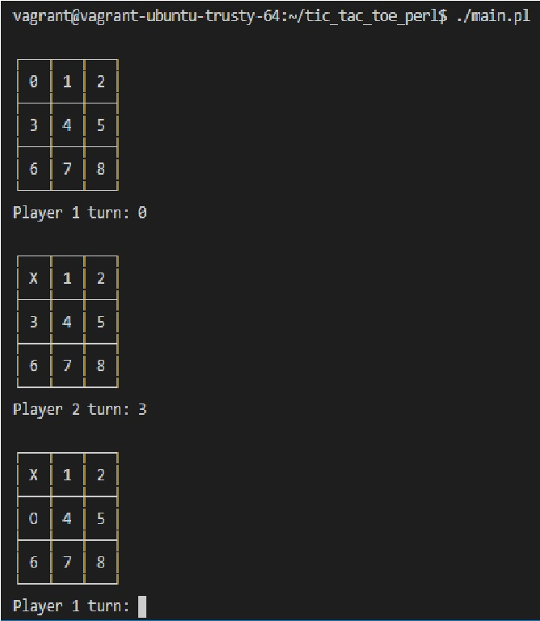

# tic tac toe made in perl

## Holberton Cali  // Cohort 10

### Team members
* Oscar Gomez Toro
* Jesus Acevedo Cano
* Mauricio Drada Dávila
* Jhonatan Legarda Cruz

### About the Perl language
Perl is a highly capable, feature-rich programming language that supports object-oriented, procedural and functional programming,  includes powerful tools for processing text that make it ideal for working with HTML, XML, and all other mark-up and natural languages, due to this and a rapid development cycle is an ideal web programming language. Originally developed for text manipulation and, nowadays is used for a wide range of tasks including system administration, web development, network programming, GUI development, and more.

### code info here
...

### game images

